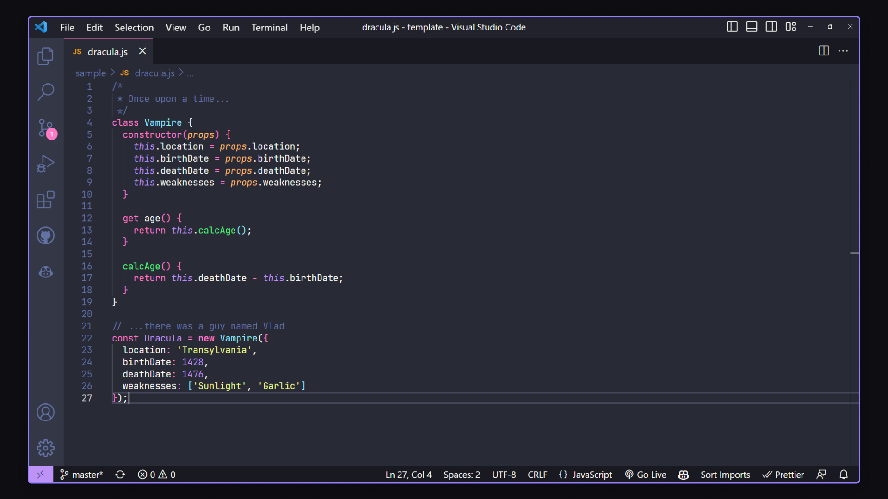

# Dracula for [FreshIDE](https://fresh.flatassembler.net/)

> A dark theme for [FreshIDE](https://fresh.flatassembler.net/).

## Install

All instructions can be found at [draculatheme.com/freshide](https://draculatheme.com/freshide).

## Team

This theme is maintained by the following person(s) and a bunch of [awesome contributors](https://github.com/dracula/freshide/graphs/contributors).

 |
:---: |
[gresm ](https://github.com/gresm) |
## Community

- [Twitter](https://twitter.com/draculatheme) - Best for getting updates about themes and new stuff.
- [GitHub](https://github.com/dracula/dracula-theme/discussions) - Best for asking questions and discussing issues.
- [Discord](https://draculatheme.com/discord-invite) - Best for hanging out with the community.

## Dracula PRO

## License

[MIT License](./LICENSE)

[Inconsolata font](https://fonts.google.com/specimen/Inconsolata) located at [``./Inconsolata.ttf``](./Inconsolata.ttf) is licensed under the [SIL Open Font License 1.1](./OFL.txt).
